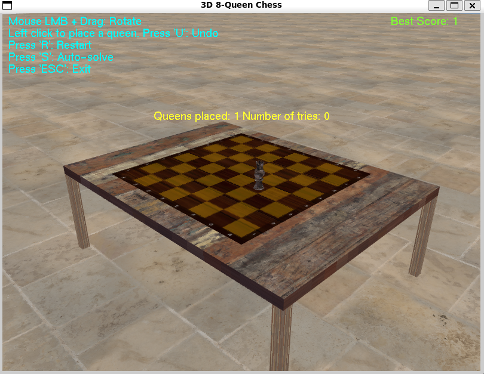

# 🎯 3D 8-Queens Puzzle Game

<div align=## 🚀 Quick Start

### Prerequisites Check
- **C++ Compiler** (GCC/MinGW/Clang)
- **OpenGL** development libraries
- **OpenAL** audio library
- **FreeType** font rendering

### One-Command Setup & Run
```bash
# Linux
make && make run

# Windows (PowerShell)
.\build.ps1
```

### 🌐 Web Version (Bro### � Planned Features
- [ ] **👥 Multiplayer** - Online competitive mode
- [ ] **📱 Mobile App** - iOS/Android versions
- [ ] **🎨 Themes** - Multiple visual themes
- [ ] **📊 Statistics** - Detailed performance analytics
- [ ] **🎵 Soundtrack** - Background music
- [ ] **💾 Save States** - Resume interrupted games
- [ ] **🏆 Leaderboards** - Global high scores)
```bash
# Build web version
make -f Makefile.web

# Open index.html in your browser
# Or host on GitHub Pages for free online play
```

**Note**: Web version supports view rotation and auto-solve. Mouse placement is disabled due to browser limitations.

--- Preview](https://img.shields.io/badge/Status-Complete-success?style=for-the-badge)


**A breathtaking 3D implementation of the classic 8-Queens puzzle**  
*Immersive graphics • Interactive gameplay • Spatial audio • Auto-solve algorithm*

[🎮 Live Demo](#) • [📥 Download](#installation) • [🎯 Play Now](#getting-started)

---

</div>

## � Features

<div align="center">

| ✨ **Visual Excellence** | 🎮 **Gameplay** | 🔊 **Audio Experience** |
|:---:|:---:|:---:|
| Stunning 3D chessboard with realistic lighting | Intuitive mouse & keyboard controls | 3D positional sound effects |
| Detailed room environment | Auto-solve with backtracking | Victory celebration sounds |
| High-quality textures | High score tracking | Immersive audio feedback |
| Smooth animations | Undo/Reset functionality | Volume controls |

</div>

## 🎮 Game Preview

<div align="center">


*Screenshot of the immersive 3D chessboard environment*

</div>

## 🚀 Quick Start

### Prerequisites Check
- **C++ Compiler** (GCC/MinGW/Clang)
- **OpenGL** development libraries
- **OpenAL** audio library
- **FreeType** font rendering

### One-Command Setup & Run
```bash
# Linux
make && make run

# Windows (PowerShell)
.\build.ps1
```

## 📋 Table of Contents

- [🎯 Overview](#-overview)
- [✨ Features](#-features)
- [🎮 Controls](#-controls)
- [🛠️ Installation](#️-installation)
- [🚀 Getting Started](#-getting-started)
- [📁 Project Structure](#-project-structure)
- [🎨 Technical Stack](#-technical-stack)
- [🧩 How to Play](#-how-to-play)
- [🔧 Customization](#-customization)
- [🛣️ Roadmap](#️-roadmap)
- [🤝 Contributing](#-contributing)
- [📄 License](#-license)
- [🙏 Acknowledgments](#-acknowledgments)

---

## 🎯 Overview

Welcome to the **ultimate 3D 8-Queens experience**! This project transforms the classic mathematical puzzle into a visually stunning, interactive 3D environment. Place 8 queens on a chessboard so that no two queens threaten each other - a perfect blend of algorithmic beauty and modern graphics.

### 🎯 The Challenge
The 8-Queens problem is a classic constraint satisfaction puzzle that requires placing eight chess queens on an 8×8 chessboard so that no two queens attack each other. This implementation brings the puzzle to life with:
- **3D Visualization**: See the queens and board in immersive 3D space
- **Real-time Feedback**: Instant validation with visual and audio cues
- **Intelligent Solving**: Watch the backtracking algorithm find solutions
- **Performance Tracking**: Compete with yourself to minimize moves

---

## 🎮 Controls

<div align="center">

| Action | Control | Description |
|:---:|:---:|:---:|
| **Rotate View** | 🖱️ Left Click + Drag | Orbit around the chessboard |
| **Place Queen** | 🖱️ Left Click on Square | Place queen (if valid) |
| **Undo Move** | ⌨️ **U** Key | Remove last queen |
| **Reset Board** | ⌨️ **R** Key | Clear all queens |
| **Auto-Solve** | ⌨️ **S** Key | Watch algorithm solve |
| **Exit Game** | ⌨️ **ESC** | Close application |

</div>

---

## 🛠️ Installation

### 🐧 Linux (Ubuntu/Debian)

#### Option 1: Automated Setup
```bash
# Install all dependencies
sudo apt-get update
sudo apt-get install -y build-essential libglut3-dev libglu1-mesa-dev \
                        libgl1-mesa-dev libfreetype6-dev libopenal-dev \
                        libalut-dev freeglut3-dev

# Build and run
make
make run
```

#### Option 2: Manual Compilation
```bash
# Install dependencies
sudo apt-get install build-essential libglut3-dev libopenal-dev libfreetype6-dev

# Compile
g++ main.cpp -o main \
    -I./include/stb \
    -I./include/tinyobjloader \
    -I/usr/include/freetype2 \
    -I/usr/include/AL \
    -lglut -lGLU -lGL -lfreetype -lopenal

# Run
./main
```

### 🪟 Windows

#### Option 1: Automated Setup (Recommended)
```powershell
# Run the PowerShell build script
.\build.ps1
```

#### Option 2: Manual Setup with MinGW
```cmd
REM Install MinGW-w64 and dependencies via MSYS2 or Chocolatey
choco install mingw
choco install freeglut

REM Compile
g++ main.cpp -o main.exe ^
    -I./include/stb ^
    -I./include/tinyobjloader ^
    -I"C:\path\to\freetype\include" ^
    -I"C:\path\to\openal\include" ^
    -L"C:\path\to\freetype\lib" ^
    -L"C:\path\to\openal\lib" ^
    -lfreetype -lopenal32 -lglut32 -lglu32 -lopengl32

REM Run
main.exe
```

#### Option 3: Visual Studio
1. Open `main.cpp` in Visual Studio
2. Install NuGet packages:
   - `freeglut`
   - `OpenAL`
   - `FreeType`
3. Build and run the project

### 📦 Dependencies

| Library | Purpose | Linux Package | Windows Alternative |
|:---:|:---:|:---:|:---:|
| **OpenGL** | 3D Graphics | `libgl1-mesa-dev` | Windows SDK |
| **GLUT** | Window Management | `freeglut3-dev` | `freeglut` |
| **OpenAL** | 3D Audio | `libopenal-dev` | OpenAL SDK |
| **FreeType** | Text Rendering | `libfreetype6-dev` | FreeType |
| **STB Image** | Texture Loading | Included | Included |
| **TinyOBJLoader** | 3D Models | Included | Included |

---

## 🚀 Getting Started

### Quick Launch
```bash
# Clone the repository
git clone https://github.com/LeulTew/3D-8-Queens-OpenGL.git
cd 3D-8-Queens-OpenGL

# Linux: Build and run
make && make run

# Windows: Build and run
.\build.ps1
```

### First Game
1. **Launch** the application
2. **Rotate** the view by dragging with left mouse button
3. **Click** on chessboard squares to place queens
4. **Listen** for audio feedback on valid/invalid moves
5. **Press 'S'** to watch the auto-solve algorithm
6. **Try to beat** your high score!

---

## 📁 Project Structure

```
3D-8-Queens-OpenGL/
├── 📄 main.cpp                 # Core game logic & rendering
├── 📄 Makefile                 # Linux build automation
├── 📄 build.ps1               # Windows build script
├── 📄 .gitignore              # Git ignore rules
├── 📁 screenshots/            # Game screenshots for README
│   └── 🖼️ game-preview.png    # Main game screenshot
├── 📁 resources/              # Game assets
│   ├── 🎨 chessboard.jpg      # Chessboard texture
│   ├── 🎨 wood.jpg            # Table surface
│   ├── 🎨 ground.jpg          # Floor texture
│   ├── 📊 highscore.txt       # Score persistence
│   ├── 🎵 queen_placed.wav    # Placement SFX
│   ├── 🎵 win_sound.wav       # Victory fanfare
│   └── 📦 Queen/              # 3D Queen model
│       ├── 📐 model.obj       # 3D geometry
│       └── 🎨 *.jpg           # Model textures
├── 📁 include/                # Third-party headers
│   ├── 🖼️ stb/               # Image loading
│   └── 📦 tinyobjloader/      # OBJ model loader
└── 📄 README.md               # This file
```

---

## 🎨 Technical Stack

<div align="center">

### Core Technologies


### Architecture
- **Rendering Engine**: OpenGL with GLUT windowing
- **Audio System**: OpenAL with 3D spatial positioning
- **Text Rendering**: FreeType with bitmap fonts
- **Asset Loading**: STB libraries for textures
- **3D Models**: Wavefront OBJ format
- **Algorithm**: Recursive backtracking solver

</div>

---

## 🧩 How to Play

### 🎯 Objective
Place **8 queens** on the chessboard so that:
- ❌ No two queens share the same **row**
- ❌ No two queens share the same **column**
- ❌ No two queens share the same **diagonal**

### 📋 Rules
1. **Valid Moves**: Queens can only be placed on empty squares
2. **Threat Detection**: Invalid placements are rejected
3. **Scoring**: Minimize the number of attempts
4. **Winning**: All 8 queens placed without conflicts

### 🏆 Scoring System
- **High Score**: Tracks minimum moves to solve
- **Attempts**: Current game attempt counter
- **Auto-Solve**: Demonstrates optimal solution

---

## 🔧 Customization

### Board Configuration
```cpp
// In main.cpp
#define BOARD_SIZE 8  // Change for different sizes
#define QUEEN_COUNT 8 // Adjust queen count
```

### Visual Themes
- Replace textures in `resources/` folder
- Modify lighting parameters in the code
- Adjust camera positioning and angles

### Audio Settings
- Replace `.wav` files for custom sounds
- Modify volume levels in OpenAL calls
- Add new sound effects for different events

### Performance Tuning
- Adjust rendering quality vs. performance
- Modify animation speeds
- Configure texture resolutions

---

## 🛣️ Roadmap

### � Planned Features
- [ ] **🌐 Web Version** - WebGL port for browser play
- [ ] **👥 Multiplayer** - Online competitive mode
- [ ] **📱 Mobile App** - iOS/Android versions
- [ ] **🎨 Themes** - Multiple visual themes
- [ ] **📊 Statistics** - Detailed performance analytics
- [ ] **🎵 Soundtrack** - Background music
- [ ] **💾 Save States** - Resume interrupted games
- [ ] **🏆 Leaderboards** - Global high scores

### 🔄 Recent Updates
- ✅ **🌐 Web Version** - Emscripten port for browser play
- ✅ **Dual Audio Sources** - Fixed sound conflicts
- ✅ **Cross-Platform** - Linux & Windows support
- ✅ **Auto-Solve** - Backtracking algorithm
- ✅ **High Scores** - Persistent scoring system

---

## 🤝 Contributing

We welcome contributions! Here's how to get involved:

### 📝 Contribution Process
1. **Fork** the repository
2. **Create** a feature branch (`git checkout -b feature/amazing-feature`)
3. **Commit** changes (`git commit -m 'Add amazing feature'`)
4. **Push** to branch (`git push origin feature/amazing-feature`)
5. **Open** a Pull Request

### 🐛 Bug Reports & Feature Requests
- Use [GitHub Issues](https://github.com/LeulTew/3D-8-Queens-OpenGL/issues)
- Provide detailed descriptions and screenshots
- Include system information and reproduction steps

### 📖 Development Setup
```bash
# Clone and setup
git clone https://github.com/LeulTew/3D-8-Queens-OpenGL.git
cd 3D-8-Queens-OpenGL

# Install development dependencies
make deps  # Linux
# or
.\build.ps1 -Dev  # Windows
```

---

## 📄 License

<div align="center">

**This project is open source and available under the MIT License**

[](https://opensource.org/licenses/MIT)

*Feel free to use, modify, and distribute this project*

</div>

---

## 🙏 Acknowledgments

### 🎨 Assets & Resources
- **Queen 3D Model**: Sourced from online 3D model repositories
- **Sound Effects**: Custom created for this project
- **Textures**: Curated from free texture libraries

### 📚 Libraries & Tools
- **OpenGL**: Industry-standard 3D graphics API
- **OpenAL**: Cross-platform 3D audio library
- **FreeType**: Professional font rendering engine
- **STB Libraries**: Lightweight C utilities
- **TinyOBJLoader**: Simple OBJ model loader

### 👥 Special Thanks
- **Open Source Community**: For the amazing libraries
- **Computer Science Educators**: For inspiring algorithmic puzzles
- **Beta Testers**: For feedback and bug reports

---

<div align="center">

## 🎉 Ready to Play?

**Experience the 8-Queens puzzle like never before!**

[](#getting-started)

### Connect With Us
[](https://github.com/LeulTew/3D-8-Queens-OpenGL)
[](https://github.com/LeulTew/3D-8-Queens-OpenGL/issues)

---

**Made with ❤️ and lots of ☕**

*Challenge your mind • Enjoy the beauty • Share the experience*

</div>